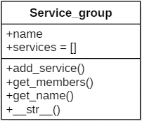

Spécifications
==============

Dans cette partie vous trouverez les détails des différents paquetages et modules.

Vocabulaire
+++++++++++

.. glossary::
        module
             Un module est un fichier .py contenant les définitions des objets, fonctions et variables. Les définitions d'un module peuvent être importées dans un autre module.
        
        paquetage
             Un paquetage en python est un dossier contenant un fichier __init__.py et plusieurs modules. Le fichier __init__.py permet lors de l'execution du script d'indiquer à l'interprèteur python que c'est un paquetage python, *python package* en anglais. 

Quels sont les paquetages de Forticonf parser?
++++++++++++++++++++++++++++++++++++++++++++++

Les paquetages composants *Forticonf parser* sont les suivants:

.. glossary::

        file
            Ce paquetage contient les modules servant à la gestion de fichiers. Ces modules seront décrits plus en détails dans la section **modules**.
            Les modules du paquetage *file* sont les suivants: **parser** - **excel_writer** - **jinja_writer**

        host
            Ce paquetage contient le module **FWaddress** qui va permettre la gestion des objets *address* et *address group*.

        service
            Ce paquetage contient le module **service** qui va permettre la gestion des objets *service* et *service group*.

        policy
            Ce paquetage contient le module **policy** qui va permettre la gestion des objets *policy*.
        

Comment fonctionne les modules de Forticonf Parser?
++++++++++++++++++++++++++++++++++++++++++++++++++++

Chaque paquetage du script Forticonf Parser est composé d'un ou plusieurs modules.

Il existe néanmoins des modules qui sont communs à tous les paquetages et qui sont situé à la racine du projet.

Ces modules sont les suivants: 

* object
* print_x

Le module **print_x** est utilisé à des fins d'affichage.

Il contient les fonctions suivantes:

* print_done
* print_err
* print_warning

Le module **object**
--------------------

Ce module contient la classe **Object**.

La représentation de cette classe est la suivante:

Les classes héritantes de celle-ci possèderont les méthodes **get_attrs** et **convert_to_row**. Leurs méthodes __init__ et __str__ seront surchargées par celles de la classe *Object*.

**La méthode __init__:**

Cette méthode permet d'initialiser les attributs de la classe héritant de la classe *Object*.
En effet elle est définit comme ceci:

.. code-block:: python

        def __init__(self, tmp_dict=None)

Elle prend en paramètre un dictionnaire contenant les attributs de l'objet que l'on souhaite instancier, vérifie si l'objet en question possède les attributs contenus dans le dictionnaire, puis l'initialise avec les valeurs spécifiées dans le dictionnaire.

**La méthode __str__**:

Cette méthode retourne une représentation affichable de l'object.

Par exemple, si l'on souhaite afficher l'objet **policy**, on pourra donc effectuer cela simplement, par exemple:

.. code-block:: python 
        
        tmp_dict= {
                'policy_number': '920',
                'srcintf' : 'any',
                'dstintf' : 'any',
                'srcaddr' : 'all',
                'destaddr': 'all',
                'service' : 'ALL'
        }
        policy = Policy(tmp_dict)
        print(policy)

Ce qui donnera un résultat similaire au suivant:

  

**La méthode get_attrs:** 

Cette méthode retourne un dictionnaire contenant le nom des attributs des objets comme clés et leurs valeurs.

**La méthode convert_to_row:**

Cette méthode retourne une liste contenant uniquement les valeurs des attributs de l'objet.
Si l'attribut est null, la valeur sera un espace `" "`.

Le module **FWaddress**
------------------------

Ce module contient les classes permettant la gestion des **Addresses** et des **Groupes d'addresses**.

**La classe Network_addr:** 

Cette classe définit une adresse réseau suivant l'implémentation du constructeur Fortinet.
L'adresse peut appartenir à un groupe d'addresses.

Sa représentation est la suivante:

**La classe Address_group:**

Cette classe correspond à un groupe d'adresses réseau. Celle-ci n'hérite pas de la classe Object. Donc il est nécessaire d'utiliser ses méthodes afin de finir la construction de l'objet.

Elle contient une liste des noms des membres du groupe.

Sa représentation est:

Le module **service**
---------------------

Ce module contient les classes **Service** et **Service_group**.

**La classe Service:**

Cette classe définit un service comme ceci:

**La classe service groupe:**

Cette classe correspond à un groupe de service contenant donc plusieurs services. Celle-ci n'hérite pas n'en plus de la classe *Object*.

La représentation de cette classe est la suivante: 

L'attribut **services** contient le nom des services et non les objets.

Le module **policy**
--------------------

Ce module contient la classe **policy** qui représente donc une police de sécurité appliqué sur les objets adresses ou sur des groupes d'adresses en autorisant ou en bloquant des services ou groupes de services.

Le module **parser**
--------------------

Ce module est le module principal. Il s'occupe de lire le fichier de configuration, de le parser et de créé les objets correspondants. Il contient les deux classes suivantes, la classe **file_reader** et la classe **file_parser**.

**La classe file_reader:**

Cette classe permet de lire un fichier et d'en extraire les lignes correspondant à l'objet que l'on souhaite récupérer. 

Elle est définit comme ceci:

.. image:: pictures/file_reader.PNG

La méthode **get_line_from_file** lit le fichier et retourne ligne par ligne.

La méthode **get_objects** est définit comme suite:

.. code-block:: python
        
        def get_objects(self, object=''):
            """ Corps de la méthode  """
            return lines
        
En effet, elle utilise la méthode *get_line_from_file* pour parcourir le fichier. En parcourant le fichier, elle reconnaît certaines patterns, comme par exemple *config firewall address* correspondrait à un objet de type adresse réseau ou encore *config firewall policy* correspondrait à une politique de sécurité. Elle retourne les lignes récupérées dans une liste.

**La classe File_parser:**

Cette classe utilise la classe File_reader pour récupérer les lignes du fichier de configuration que l’on a donné en argument au script. Une fois les lignes récupérés, elle cherche dans ces lignes les attributs que le script reconnais(attributs qui sont implémentés). 
Si l’attribut d’un objet n’est pas implémenté et est retrouvé lors de l'exécution du script. Cet attribut est affiché sur la console en tant que warning.
Après avoir récupérer les attributs de l’objet, il sera instancié puis ajouter à la liste des objets du même type.

C'est la classe principale du script, elle coordone la création des objets, par exemple, la création des objets (groupes de réseau) avant la création des objets (réseaux).
Elle contient aussi, les méthodes qui permettent l'accès aux objets créé ou à certains de leurs attributs.

Sa représentation est la suivante:

Le module excel writer:
_______________________

Ce module contient la classe Excel_writer, qui est décrite comme ceci:

        

En effet, a son instanciation elle aura comme attributs:

        - l'objet file_parser.
        - le fichier Excel dans lequel seront listé tous le sobjets récupérés. 

Elle possède les méthodes nécessaires pour convertir les objets dans un format que l'on peut écrire dans le fichier Excel. 

